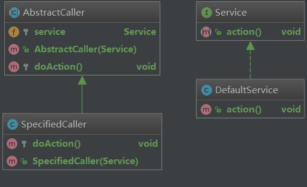

# 设计模式

[TOC]

# 创建型设计模式

## 单例模式

1 定义

- 指一个类只有一个实例，且该类能自行创建这个实例的一种模式。例如，Windows 中只能打开一个任务管理器，这样可以避免因打开多个任务管理器窗口而造成内存资源的浪费，或出现各个窗口显示内容的不一致等错误。

2 特点

- 单例类只有一个实例对象
- 该单例对象必须由单例类自行创建
- 单例类对外提供一个访问该单例的全局访问点

3 实现（构造器记得私有化）

- 懒汉方法锁

```java
public static obj synchronized getInstance(){
}
```

- 懒汉volatile加双重锁

```java
//volatile禁止指令重排序
private static volatile ins;
public static obj  getInstance(){
	if(ins==null){
       synchronized(this){
          if(ins==null){
            ins=new ...
          }
       }
	}
	return ins;
}
```

- 饿汉静态块

```java
private static ins;
static{
  ins=new ...
}
```

- 懒汉内部静态类

```java
    /**
     * lazy singleton instance init.
     */
    public static obj getInstance() {
        return DefaultLazyHolder.INSTANCE;
    }
    private static class DefaultLazyHolder {
        private static final  obj INSTANCE = new  obj();
    }
```

4 应用场景与作用

- 场景
  - 数据库连接池、线程池等
- 作用
  - 节省内存资源，同时保证数据的一致性

-------------

## 原型模式

1 定义

- 原型模式就是用原型实例指定创建对象的种类，并且通过复制这些原型创建新的对象。

在应用程序中，有些对象比较复杂，其创建过程过于复杂，而且我们又需要频繁的利用该对象，如果这个时候我们按照常规思维new该对象，那么务必会造成资源浪费，这个时候我们就希望可以利用一个已有的对象来不断对他进行复制就好了，这就是编程中的“克隆”。原型模式直接操作底层二进制流，在创建复杂对象是效率提升明显。

- 原型模式分类
  - 深克隆
    - 创建一个新对象，属性中引用的其他对象也会被克隆，不再指向原有对象地址。
  - 浅克隆
    - 创建一个新对象，新对象的属性和原来对象完全相同，对于非基本类型属性，仍指向原有属性所指向的对象的内存地址。


2 特点

- 根据已有的原型实例去创建实例，适用于创建实例过程消耗较大的情况。

3 实现

- 浅拷贝

```java
/**
 * @author linxu
 * @date 2020/1/19
 * <tip>take care of yourself.everything is no in vain.</tip>
 * clone方法是在Object种定义的,而且是protected型的,只有实现了这个接口，
 * 才可以在该类的实例上调用clone方法,否则会抛出CloneNotSupportException。
 * Object中默认的实现是一个浅拷贝,也就是表面拷贝,如果需要实现深层次拷贝的话,必须对类中可变域生成新的实例。
 */
public class ShallowCloneObj implements Cloneable {
    private Ref strRef;

    public ShallowCloneObj(Ref strRef) {
        this.strRef = strRef;
    }

    @Override
    protected Object clone() throws CloneNotSupportedException {
        return super.clone();
    }

    public static void main(String[] args) throws Exception {
        Ref ref=new Ref("i am ref.");
        ShallowCloneObj originObj = new ShallowCloneObj(ref);
        ShallowCloneObj cloneObj = (ShallowCloneObj) originObj.clone();
        System.out.println(originObj.strRef.getRefStr() + "----");
        System.out.println(cloneObj.strRef.getRefStr() + "++++");
        //change ref
        ref.setRefStr("new ref str.");
        System.out.println("==================================================");
        System.out.println(originObj.strRef.getRefStr() + "----");
        System.out.println(cloneObj.strRef.getRefStr() + "++++");
    }
   static class Ref{
        String refStr;

        public String getRefStr() {
            return refStr;
        }

        public void setRefStr(String refStr) {
            this.refStr = refStr;
        }

       public Ref(String refStr) {
           this.refStr = refStr;
       }
   }
}
```

- 深拷贝（两种方式）

```java
public class DeepCloneObj implements Cloneable {
    private DeepCloneObj.Ref strRef;

    public DeepCloneObj(DeepCloneObj.Ref strRef) {
        this.strRef = strRef;
    }

    @Override
    protected Object clone() throws CloneNotSupportedException {
        Object object = super.clone();
        //impl deep clone
        DeepCloneObj deepCloneObj = (DeepCloneObj) object;
        deepCloneObj.strRef = (Ref) this.strRef.clone();
        return deepCloneObj;
    }

    public static void main(String[] args) throws Exception {
        DeepCloneObj.Ref ref = new DeepCloneObj.Ref("i am ref.");
        DeepCloneObj originObj = new DeepCloneObj(ref);
        DeepCloneObj cloneObj = (DeepCloneObj) originObj.clone();
        System.out.println(originObj.strRef.getRefStr() + "----");
        System.out.println(cloneObj.strRef.getRefStr() + "++++");
        //change ref
        ref.setRefStr("new ref str.");
        System.out.println("==================================================");
        System.out.println(originObj.strRef.getRefStr() + "----");
        System.out.println(cloneObj.strRef.getRefStr() + "++++");
    }

    /**
     * 引用属性也实现cloneable
     */
    static class Ref implements Cloneable {
        String refStr;

        public String getRefStr() {
            return refStr;
        }

        public void setRefStr(String refStr) {
            this.refStr = refStr;
        }

        public Ref(String refStr) {
            this.refStr = refStr;
        }

        @Override
        protected Object clone() throws CloneNotSupportedException {
            return super.clone();
        }
    }
}
```

```java
public class DeepSerializableCloneObj implements Serializable {
    private Ref strRef;

    public DeepSerializableCloneObj(Ref strRef) {
        this.strRef = strRef;
    }

    @Override
    public String toString() {
        return "DeepSerializableCloneObj{" +
                "strRef=" + strRef +
                '}';
    }

    static class Ref implements Serializable {
        String refStr;

        public String getRefStr() {
            return refStr;
        }

        public void setRefStr(String refStr) {
            this.refStr = refStr;
        }

        public Ref(String refStr) {
            this.refStr = refStr;
        }

        @Override
        public String toString() {
            return "Ref{" +
                    "refStr='" + refStr + '\'' +
                    '}';
        }
    }

    public static void main(String[] args) throws Exception{
        Ref ref=new Ref("序列化克隆");
        DeepSerializableCloneObj origin=new DeepSerializableCloneObj(ref);
        ByteArrayOutputStream byteArrayOutputStream=new ByteArrayOutputStream();
        ObjectOutputStream oos=new ObjectOutputStream(byteArrayOutputStream);
        oos.writeObject(origin);
        byte[] objbytes=byteArrayOutputStream.toByteArray();

        ByteArrayInputStream byteArrayInputStream=new ByteArrayInputStream(objbytes);
        ObjectInputStream objectInputStream=new ObjectInputStream(byteArrayInputStream);

        DeepSerializableCloneObj cloneObj=(DeepSerializableCloneObj) objectInputStream.readObject();
        System.out.println(origin+"--");
        System.out.println(cloneObj+"++");
        //change ref
        ref.setRefStr("change");
        System.out.println(origin+"--");
        System.out.println(cloneObj+"++");

    }
}
```

4 应用场景与作用缺点

- 应用场景
  - 创建新对象成本较大（如初始化需要占用较长的时间，占用太多的CPU资源或网络资源），新的对象可以通过原型模式对已有对象进行复制来获得，如果是相似对象，则可以对其成员变量稍作修改。
  - 如果系统要保存对象的状态，而对象的状态变化很小，或者对象本身占用内存较少时，可以使用原型模式配合备忘录模式来实现。
- 作用
  - 减少创建一个类似对象的消耗。
- 缺点
  - 需要为每一个类配备一个克隆方法，而且该克隆方法位于一个类的内部，当对已有的类进行改造时，需要修改源代码，违背了“开闭原则”。
  - 在实现深克隆时需要编写较为复杂的代码，而且当对象之间存在多重的嵌套引用时，为了实现深克隆，每一层对象对应的类都必须支持深克隆，实现起来可能会比较麻烦。

---------------

## Builder模式

1 定义

- builder模式也称为建造者模式，它就是将复杂事物创建的过程抽象出来，该抽象的不同实现方式不同，创建出的对象也不同。一个实例的属性有多种组合，可以由构造者自行组合构建。

2 特点

- 将实例的组装创建与负责组装创建的责任分离，同时实现自由组合。
- 避免了多种属性组合的构造器（传值构造有时候参数太多并不方便）。

3 实现

- 经典Builder模式（这里就写出具体的代码了）
  - 定义XXbuilder接口，实现多种builder实现，利用多种builder实现配合director（监工）去创建实例。
- Builder进阶也成为Builder变种
  - 下面的Builder变种在个人的distributedGateWay和RaftK-V项目中用到，使用起来非常灵活。

```java
public class LogEntry implements Serializable,Comparable {
    /**
     * 日志索引
     */
    private Long index;
    /**
     * 日志任期号码
     */
    private long term;

    public LogEntry() {
    }

    public LogEntry(long term ) {
        this.term = term;
    }

    public LogEntry(Long index, long term) {
        this.index = index;
        this.term = term;
    }

    private LogEntry(Builder builder) {
        index=builder.index;
        term=builder.term;
    }

    public static Builder Builder() {
        return new Builder();
    }

    @Override
    public int compareTo(Object o) {
        if (o == null) {
            return -1;
        }
        if (this.index > ((LogEntry) o).index) {
            return 1;
        }
        return -1;
    }

    @Override
    public boolean equals(Object o) {
        if (this == o) {
            return true;
        }
        if (o == null || getClass() != o.getClass()) {
            return false;
        }
        LogEntry logEntry = (LogEntry) o;
        return term == logEntry.term &&
                Objects.equals(index, logEntry.index);
    }

    @Override
    public int hashCode() {
        return Objects.hash(index, term);
    }

    public static final class Builder {
        private Long index;
        private long term;
        private Builder() {
        }
        public Builder index(Long val) {
            index = val;
            return this;
        }
        public Builder term(long val) {
            term = val;
            return this;
        }
        
        public LogEntry build() {
            return new LogEntry(this);
        }
    }
}
```

4 应用场景与作用

- 解决重叠构造器阅读不方便且拓展不灵活的问题
  - 能够自由组合构造参数。
- 建造分离
  - 有时候我们希望这个类的属性构造过程对于该类是不可见的，而是由另外的类即建造者来封装处理，这个时候就使用建造者模式了。


当然，有好处肯定也有坏处，使用Builder毫无疑问，会消耗多一些内存，但是如果能够给代码提供更好的阅读和可维护、可拓展性，也是值得的。

----------------------

## 工厂模式

### 简单工厂（并不算GoF23中设计模式之中，它只是实现了解耦）

1 定义

- 简单工厂也称为静态工厂，实例化对象的时候不再使用 new Object()形式，可以根据用户的选择条件来实例化相关的类。对于客户端来说，去除了具体的类的依赖。只需要给出具体实例的标签给工厂，工厂就会自动返回具体的实例对象。

2 特点

- 将实例创建过程从实例的类中剥离，从而实现解耦。
- 可对类的实例创建拓展一些额外的工作，而不去违反实例类的开闭原则。
- 如需要创建其它实例，需要对工厂进行继承拓展；如果不拓展工厂，而直接修改工厂代码，违反了工厂的开闭原则。

3 实现

```java
public interface Strategy
```

```java
NormalStrategy implements Strategy{
  @Override
    public double discount() {
        return discount;
    }
}
SuperStrategy implements Strategy {
@Override
    public double discount() {
        return discount;
    }
}
public class StaticFactory {
    /**
     * @param level VIP level
     * @return 根据用户的LEVEL生成不同折扣策略
     */
    public static Strategy getStrategy(int level) {
        if (level == Level.NORMAL.val) {
            return new NormalStrategy(0.8);
        } else if (level == Level.SUPER.val) {
            return new SuperStrategy(0.6);
        } else {
            return null;
        }
    }

    enum Level {
        NORMAL(1), SUPER(2);
        int val;

        Level(int val) {
            this.val = val;
        }
    }
}
```

4 应用场景

- 场景，用于解耦，将生成实例与实例类剥离，由特定的工厂生成多态实例，可拓展额外的内容。
- 缺点
  - 如果增加子类或者实现类，则要修改工厂代码，使得工厂的责任臃肿，他需要利用一大堆的判断条件来决定生产具体哪一种实例。

--------------------

### 工厂方法

1 定义

- 使用继承，把对象的创建委托给子类，由子类来实现创建方法（即特定的工厂通过实现工厂接口来创建特定的对象），可以看作是抽象工厂模式中只有单一产品的情况。

2 特点

- 解耦
- 不会破坏开闭原则，理论上增加子类，就新开一家对应的工厂。就像下面举例的，茶工厂。
- 可拓展和维护性更好

3 实现

- 定义茶

```java
public abstract class Tea {
    protected String teaType;

    public abstract String showType();
}

```

- 定义茶工厂

```java
public interface TeaFactory {
    Tea createTea();
}
```

- 具体实现

```java
public class PuerTea extends Tea {
    public PuerTea(String type) {
        this.teaType = type;
    }

    @Override
    public String showType() {
        return null;
    }
}
public class PuerFactory implements TeaFactory {
    @Override
    public Tea createTea() {
        return new PuerTea("puer");
    }
}
```

4 应用场景与作用

- 工厂方法针对的是某一类对象，即茶工厂针对的都是各种茶对象，由对应的茶的工厂去创建实例。更加灵活且拓展性更好。
- 缺点
  - 假如系统需要生产除了茶还有酒，那么，就需要创建更多的类，比如酒厂接口，各种酒，酒的抽象等等。这个时候，代码就会显得臃肿，所以有人提出，**抽象工厂**（即该工厂能够创建酒、茶等各种东西），而抽象工厂的实现也具有相应的职能。

### 抽象工厂

1 定义

- 工厂是抽象的，它能够定义生产多种类产品的规范。抽象工厂的实现也有多种生产能力。

2 特点

- 化零为整，把各式各样的工厂，合并成一个多功能的工厂。
- 在实现解耦的基础上，更加容易管理。

3 实现

```java
public interface AbstractFactory {
    Tea createTea();

    Beard createBeard();
}
public abstract class Beard {
    protected String beardName;
}
public class Hanbeger extends Beard {
    public Hanbeger(String name) {
        this.beardName = name;
    }
}
public class ShenZhenFactory implements AbstractFactory {
    @Override
    public Tea createTea() {
        return new WuLongTea("wulong");
    }

    @Override
    public Beard createBeard() {
        return new Hanbeger("汉堡");
    }

    /**
     * 将工厂模式与单例模式配合使用
     */
    public static ShenZhenFactory getInstance() {
        return LazyHolder.INST;
    }

    public static final class LazyHolder {
        public static final ShenZhenFactory INST = new ShenZhenFactory();
    }
}
```

4 应用场景与作用

- 用于解耦，并且实现了更加规范化的管理，对创建实例过程进行封装。
- 化零为整
- 工厂是抽象的，它能够定义生产多种类产品的规范。抽象工厂的实现也有多种生产能力。

注意：正常来讲，一个具体的工厂应当是一个单例，配合单例模式使用能够更加节省资源，这也侧面证明了，设计模式不是互相独立的，是相辅相成的。

----------------

# 结构型设计模式

引入：合成复用原则 见 附录

## 代理模式

1 定义

- 为某对象提供一种代理以控制对该对象的访问。即客户端通过代理间接地访问该对象，从而限制、增强或修改该对象的一些特性。主要体现**结构型设计模式的合成、复用原则**。
- 分类
  - 静态代理
  - 动态代理
  - cglib代理

2 特点

- 间接调用
- 限制（提供一些访问保护机制）、增强（AOP）

3 实现

- 静态代理

```java
public interface ServiceInterface {
    void doService();
}
public class DefaultServiceImpl implements ServiceInterface {
    @Override
    public void doService() {
        System.out.println("this is default service.");
    }
}
public class ProxyService implements ServiceInterface {
  //将一个对象纳入另外一个对象中，实现复用，降低耦合，提高拓展性。
    private ServiceInterface serviceInterface;

    public ProxyService(ServiceInterface serviceInterface) {
        this.serviceInterface = serviceInterface;
    }

    @Override
    public void doService() {
        //do before
        System.out.println("静态代理前置增强");
        serviceInterface.doService();
        //do after
        System.out.println("静态代理后置增强");
    }
}
```

- 动态代理(被代理类必须实现接口)

```java
public interface ServiceInterface {
    void doService();
    void doAnoService();
}
public class DefaultServiceImpl implements ServiceInterface {
    @Override
    public void doService() {
        System.out.println("this is default service.");
    }

    @Override
    public void doAnoService() {
        System.out.println("this is ano service.");
    }
}
@SuppressWarnings("unchecked")
public class DynamicProxyService implements InvocationHandler {
    private Object target;

    public DynamicProxyService(Object target) {
        this.target = target;
    }

    public Object getProxyObject() {
        return Proxy.newProxyInstance(target.getClass().getClassLoader(), target.getClass().getInterfaces(), this);
    }

    @Override
    public Object invoke(Object proxy, Method method, Object[] args) throws Throwable {
        //do before
        System.out.println("前置增强");
        Object retObj = method.invoke(target, args);
        System.out.println("后置增强");
        return retObj;
    }
}
```

- cglib代理（能够解决动态代理的接口缺陷）

```java
public class DefaultServiceWithouInterface {
    public void doAction() {
        System.out.println("i am without impl any interface.");
    }
}
@SuppressWarnings("unchecked")
public class CglibProxyService {
    private Object target;

    public CglibProxyService(Object target) {
        this.target = target;
    }

    public Object getProxy() {
        Enhancer enhancer = new Enhancer();
        //设置代理类
        enhancer.setSuperclass(target.getClass());
        enhancer.setCallback((MethodInterceptor) (o, method, objects, methodProxy) -> {
            System.out.println("CGLIB前置增强");
            Object ret = methodProxy.invoke(target, objects);
            System.out.println("CGLIB后置增强");
            return ret;
        });
        return enhancer.create();
    }
}
public class CglibTest {
    public static void main(String[] args) {
        DefaultServiceWithouInterface serviceWithouInterface = new DefaultServiceWithouInterface();
        CglibProxyService proxyService = new CglibProxyService(serviceWithouInterface);
        DefaultServiceWithouInterface proxy = (DefaultServiceWithouInterface) proxyService.getProxy();
        proxy.doAction();
    }
}
```

4 应用场景与总结

- 静态代理
  - 只需要实现与目标对象相同的接口，并将目标对象纳入代理对象中，从而进行静态增强。
  - 适用于代理对象少，否则会出现过多的代理代码。
  - 速度快，因为是硬编码，无需动态创建加载。
- 动态代理
  - 实现invokeHandler接口，使用的是反射代理方法，性能会较弱一些，但是可以减少代理类的数量，使用灵活。
  - 缺点是目标对象必须实现接口，否则无法代理。
- Cglib代理
  - 使用字节码工具，基于类代理，可解决动态代理的缺点，且性能较反射快一些。
  - 但是cglib代理会通过继承机制来重写增强方法，因此，最怕final，会无法实现增强。
- 代理模式在编码中应用最多的就是增强与限制，同时也常用与一些客户端代理等等。

---------------

## 适配器模式

1 定义

- 将一个类的接口转换成客户希望的另外一个接口，使得原本由于接口不兼容而不能一起工作的那些类能一起工作。适配器模式分为类结构型模式和对象结构型模式两种，前者类之间的耦合度比后者高，且前者只适用于单源适配者，后者可以通过对象依赖实现多源适配。

- 例如

  - 显示器接口HDMI
  - 主机接口是一种罕见的，这里叫SPECIAL

  这样的主机是使用不了该显示器的，但是，有没有专门制作一种显示器接口是SPECIAL呢，没必要，因为，这种主机很罕见，专门制作这样的显示器，毫无疑问，如果主机商家不生产了，那么剩下的显示器毫无作用。

  - 引入适配器，一个连通组件，解决接口规范不一致问题，该适配器功能是HDMI转SPECIAL。也就是类适配器的功能。

  正常情况下类适配器已足够使用，当然，我们见过很多适配器，是多对一的适配的，那就类似于对象类型适配器，能够适配多源适配者（显示器）

2 特点

- 通过适配器就可以调用目标接口
- 对现有的可复用代码实现复用
- 通过适配器，将目标和适配者解耦，解决接口不一致问题

3 实现

- 类适配器

```java
public class Monitor {
    /**
     * 显示器的显示
     */
    public void show(){
        System.out.println("TV OPEN.");
    }
}
public interface Computer {
    String print(String msg);
    String print();
}
public class Adapter extends Monitor implements Computer {
    @Override
    public String print(String msg) {
        System.out.println(msg);
        super.show();
        return msg;
    }

    @Override
    public String print() {
        super.show();
        return null;
    }
}
```

- 类适配器总结
  - 适配者不允许为final，且只允许单源适配；
  - 目标类只允许是接口，存在局限性

----------

- 对象适配

```java
public class Printer {
    public void print(String printMsg) {
        System.out.println(printMsg);
    }
}
public class Moniter {
    public void showInScreen(String msg) {
        System.out.println(msg);
    }
}
//以上都是适配者
public class MultiAdapter extends Laptop {
    private Monitor monitor;
    private Printer printer;
  //...constructors...
    @Override
    public void printAnyWay(String msg) {
        printer.print(msg);
    }
}
//目标类
public class Laptop {
    public void printAnyWay(String msg) {
        //none
    }
}
```

- 对象适配总结
  - 目标类可以为接口、抽象类、子类，范围广
  - 可以进行多源适配，灵活，但是需要初始化属性依赖

4 应用场景与作用

- 作用
  - 在不违反开闭原则下兼具灵活性与拓展性
  - 实现目标与适配者的解耦
- 场景（SpringMVC框架）
  - 组件：Controller
    - XXController(各种控制器实现)

Spring MVC中的适配器模式主要用于执行目标 `Controller` 中的请求处理方法。在Spring MVC中，`DispatcherServlet` 作为用户，`HandlerAdapter` 作为期望接口，具体的适配器实现类用于对目标类进行适配，`XXController` 作为需要适配的类。

处理器适配器接口

```java
public interface HandlerAdapter {
    boolean supports(Object var1);
    ModelAndView handle(HttpServletRequest var1, HttpServletResponse var2, Object var3) throws Exception;
    long getLastModified(HttpServletRequest var1, Object var2);
}
```

 HttpRequestHandlerAdapter

```java
public class HttpRequestHandlerAdapter implements HandlerAdapter {
    public HttpRequestHandlerAdapter() {
    }
    public boolean supports(Object handler) {
        return handler instanceof HttpRequestHandler;
    }
    public ModelAndView handle(HttpServletRequest request, HttpServletResponse response, Object handler) throws Exception {
      //对象类型适配器，通过入参
        ((HttpRequestHandler)handler).handleRequest(request, response);
        return null;
    }
    public long getLastModified(HttpServletRequest request, Object handler) {
        return handler instanceof LastModified ? ((LastModified)handler).getLastModified(request) : -1L;
    }
}

```

假设没有使用适配器，那么在DispatcherServlet中的不同handler控制应该如下形式：

```java
if(mappedHandler.getHandler() instanceof MultiActionController){  
   ((MultiActionController)mappedHandler.getHandler()).handleRequest(request, response);
}else if(mappedHandler.getHandler() instanceof XXX){  
    ...  
}else if(...){  
   ...  
}  
```

这种情况下，当需要增加handler时，就需要修改代码，违反了开闭原则（继承拓展开，修改闭）。

那么采用适配器之后，不同的请求类型采用不同的处理器处理，不同的处理器通过处理适配器进行封装，判断是否是适配只需要在子适配器中的support方法中进行类型判断，如下：

```java
  public boolean supports(Object handler) {
        return handler instanceof HttpRequestHandler;
    }
```

当Spring容器启动后，会将所有定义好的适配器对象存放在一个List集合中，当一个请求来临时，DispatcherServlet 会通过 handler 的类型找到对应适配器，并将该适配器对象返回给用户，然后就可以统一通过适配器的 hanle() 方法来调用 Controller 中的用于处理请求的方法。

```java
public class DispatcherServlet extends FrameworkServlet {
    private List<HandlerAdapter> handlerAdapters;
    
    //初始化handlerAdapters
    private void initHandlerAdapters(ApplicationContext context) {
        //..省略...
    }
    
    // 遍历所有的 HandlerAdapters，通过 supports 判断找到匹配的适配器
    protected HandlerAdapter getHandlerAdapter(Object handler) throws ServletException {
		for (HandlerAdapter ha : this.handlerAdapters) {
			if (logger.isTraceEnabled()) {
				logger.trace("Testing handler adapter [" + ha + "]");
			}
			if (ha.supports(handler)) {
				return ha;
			}
		}
	}
	
	// 分发请求，请求需要找到匹配的适配器来处理
	protected void doDispatch(HttpServletRequest request, HttpServletResponse response) throws Exception {
		HttpServletRequest processedRequest = request;
		HandlerExecutionChain mappedHandler = null;

		// Determine handler for the current request.
		mappedHandler = getHandler(processedRequest);
			
		// 确定当前请求的匹配的适配器.
		HandlerAdapter ha = getHandlerAdapter(mappedHandler.getHandler());

		ha.getLastModified(request, mappedHandler.getHandler());
					
		mv = ha.handle(processedRequest, response, mappedHandler.getHandler());
    }
	// ...省略...
}	

```

因此，SpringMVC在这个地方，通过适配器接口，然后不同的处理器通过不同的适配器进行适配，最后通过适配器去调用处理器的处理方法进行对应的请求处理。这样的话，假设没有适配器，那么，要拓展只能修改对应的handler，而handler有些又是不需要修改的；而有适配器，那么假设要拓展或者修改功能，我添加一个新的适配器即可（前提是handler本身需要满足单一职责原则，高内聚）

-----------

## 桥接器模式

1 定义

- 将抽象与实现分离，使它们可以独立变化。它是用组合关系代替继承关系来实现，从而降低了抽象和实现这两个可变维度的耦合度。

2 特点

- 将抽象和实现解耦，所以拓展能力更强
- 其实现细节对用户来说完全透明（隔离）
- 但是聚合关系建立在抽象层，系统设计之初的理解难度较高

举个例子

- 正常我们定义一个service接口，有多个serviceImpl实现，那么在调用类中，我们的调用如下：

```java
public class Caller{
   Service service;
  public Caller(Service service){
    this.service= service;
  }
  public void doAction(){
    service.action();
  }
}
```

如上，Caller就是具体的一个实现类，但是这个实现类中，具有抽象的Service属性以及调用，则抽象和具体是耦合的。引入桥接器之后呢，我们要保证抽象和具体的解耦，那么，应当如下：

```java
public abstract class AbstractCaller {
  //实现抽象对抽象的耦合；
  //依赖在抽象层
    protected Service service;

    public AbstractCaller(Service service) {
        this.service = service;
    }

    protected void doAction() {
        service.action();
    }
}
//实现层就是实现层。
public class SpecifiedCaller extends AbstractCaller {
    public SpecifiedCaller(Service service) {
        super(service);
    }

    @Override
    protected void doAction() {
        super.doAction();
    }
}
```

添加桥接器之后的类图如下：



3 实现

- 将耦合放在抽象层，即依赖的接口属性作为抽象类的属性
- 具体的调用放在调用者实现层即可，实现抽象与具体的分离，这样的好处是拓展能力更加强，然后解耦程度更高

4 应用场景和总结

- spring项目中在编写控制层controller时，可以编写抽象的控制层，由抽象控制层实现依赖；
  - 具体的控制器实现抽象控制器即可。
- 基础的工具类，可以编写一个基础的抽象工具类
  - 通过这种方式，实现不同的工具类即可，这样工具类就会很灵活，因为他的耦合层度低，可拓展性强。


----------------

## 装饰器模式

1 定义

- 指在不改变现有对象结构的情况下，动态地给该对象增加一些职责（即增加其额外功能）的模式，它属于对象结构型模式。
- 装饰模式主要包含以下角色：
  1. 抽象构件（Component）角色：定义一个抽象接口以规范准备接收附加责任的对象。
  2. 具体构件（Concrete    Component）角色：实现抽象构件，通过装饰角色为其添加一些职责。
  3. 抽象装饰（Decorator）角色：继承抽象构件，并包含具体构件的实例，可以通过其子类扩展具体构件的功能。
  4. 具体装饰（ConcreteDecorator）角色：实现抽象装饰的相关方法，并给具体构件对象添加附加的责任。

2 特点

- 采用装饰模式扩展对象的功能比采用继承方式更加灵活。
- 可以设计出多个不同的具体装饰类，创造出多个不同行为的组合。
- 缺点：如果过度装饰，会使得代码复杂。

3 实现

- sample

```java
public interface Belief {
    /**
     * kobe'spirit
     * Those time you stay up late you work hard.
     * Those time you don't feel like working.
     * You're to tired You don't put yourself but you do it anywhere.
     * That's actually the dreams.
     */
    void mambaSpirit();
}
public class KobeBelief implements Belief {
    @Override
    public void mambaSpirit() {
        System.out.println("kobe'spirit\n" +
                "     * Those time you stay up late you work hard.\n" +
                "     * Those time you don't feel like working.\n" +
                "     * You're to tired You don't put yourself but you do it anywhere.\n" +
                "     * That's actually the dreams.");
    }
}
public class BeliefDecorator implements Belief {
    private Belief belief;

    public BeliefDecorator(Belief belief) {
        this.belief = belief;
    }

    @Override
    public void mambaSpirit() {
        this.belief.mambaSpirit();
    }
}
public class SelfBeliefDecorator extends BeliefDecorator {
    public SelfBeliefDecorator(Belief belief) {
        super(belief);
    }

    @Override
    public void mambaSpirit() {
        //my declare
        System.out.println("I think so the mamba spirit,i decorate it with my additional thoughts.");
        super.mambaSpirit();
       //装饰的作用
        System.out.println("never stop!never give up!do you self.");
    }
}
```

4 应用场景

- 日志模块
  - 正常开发中，日志是采用slf4j+一种日志实现，但是整体上日志是一串串字符串，并没有什么格式，因此可能需要进行日志导入或者其它工作时候就会相对复杂，特别是在流式处理中。因此，考虑利用装饰器模式将日志进行JSON格式化是一种不错的选择，也符合装饰器模式的要求。
  - 具体实现见代码


--------------------

## 外观模式

1 定义

- 是一种通过为多个复杂的子系统提供一个一致的接口，而使这些子系统更加容易被访问的模式。该模式对外有一个统一接口，外部应用程序不用关心内部子系统的具体的细节，这样会大大降低应用程序的复杂度，提高了程序的可维护性。

2 特点

- 其实就是遵循迪米特原则，降低了子系统与客户端之间的耦合度，使得子系统的变化不会影响调用它的客户类。
- 对客户屏蔽了子系统组件，减少了客户处理的对象数目，并使得子系统使用起来更加容易。
- 降低了大型软件系统中的编译依赖性，简化了系统在不同平台之间的移植过程，因为编译一个子系统不会影响其他的子系统，也不会影响外观对象。
- 缺点
  - 增加新的子系统可能需要修改外观类或客户端的源代码，违背了“开闭原则”。

3 实现

- 不使用外观模式的时候办理不同业务

```java
public class Client {
    private LoginService loginService;
    private KernalService kernalService;
    private borderService borderService;

    public Client(LoginService loginService, KernalService kernalService, com.qgailab.designer.struct.facade.borderService borderService) {
        this.loginService = loginService;
        this.kernalService = kernalService;
        this.borderService = borderService;
    }

    public void startKernal() {
        loginService.login("", "");
        kernalService.doKernalService();
    }

    public void startBorder() {
        loginService.login("", "");
        borderService.doBorderService();
    }
}
public class borderService {
    public void doBorderService(){
        System.out.println("border service");
    }
}
public class LoginService {
    public boolean login(String username, String password) {
        //some verify
        return true;
    }
}
public class KernalService {
    public void doKernalService() {
        System.out.println("执行核心业务");
    }
}

```

- 使用外观模式

```java
public abstract class ServiceFacade {
    protected LoginService loginService;
    protected KernalService kernalService;
    protected borderService borderService;

    public ServiceFacade(LoginService loginService, KernalService kernalService, com.qgailab.designer.struct.facade.borderService borderService) {
        this.loginService = loginService;
        this.kernalService = kernalService;
        this.borderService = borderService;
    }

    protected void dokernal(){
        loginService.login("","");
        kernalService.doKernalService();
    }
}
public class Client {
    private ServiceFacade facade;

    public Client(ServiceFacade facade) {
        this.facade = facade;
    }

    public void doService() {
        facade.dokernal();
    }
}
```

4 应用场景与作用

- 对分层结构系统构建时，使用外观模式定义子系统中每层的入口点可以简化子系统之间的依赖关系。
- 当一个复杂系统的子系统很多时，外观模式可以为系统设计一个简单的接口供外界访问。
- 当客户端与多个子系统之间存在很大的联系时，引入外观模式可将它们分离，从而提高子系统的独立性和可移植性。

--------

## 享元模式

1 定义

- 运用共享技术来有効地支持大量细粒度对象的复用。它通过共享已经存在的又橡来大幅度减少需要创建的对象数量、避免大量相似类的开销，从而提高系统资源的利用率。相同对象只要保存一份，这降低了系统中对象的数量，从而降低了系统中细粒度对象给内存带来的压力。（类似于单例的思想或者说单例是享元的一个特殊情况）

2 特点

- 共享对象，节省内存
- 缺点是：
  - 享元分为内部状态与外部状态，内部状态是共享部分，而外部状态由于不同的共享时会呈现不同的不可共享信息，这一部分会增加享元设计的难度。

3 实现

- 抽象享元
- 具体享元
- 享元工厂
- 外部状态（非享元）

sample之一是字符串池

```java
//mock string flyweight
public abstract class FlyWeightString {
    private String string;
    private int length;


    public FlyWeightString(String string) {
        this.string = string;
        this.length = string.length();
    }

    /**
     *
     * @param time 外部状态
     * @return
     */
    protected abstract String printLastModifiedTime(String time);

    public String getString() {
        return string;
    }


    public int getLength() {
        return length;
    }
}
//impl
public class ConcreteFlyWeightString extends FlyWeightString {
    public ConcreteFlyWeightString(String string) {
        super(string);
    }

    @Override
    protected String printLastModifiedTime(String time) {
        System.out.println("time is:" + time);
        return time;
    }
}
//享元工厂
public class FlyWeightFactory {
  //Spring的bean工厂具有缓存功能，其实就是享元模式的应用
    private static final Map<String, FlyWeightString> map = new HashMap<>();
    @SuppressWarnings("unchecked")
    public static FlyWeightString getFlyWeight(String label, Class clazz, Object[] args) {
        FlyWeightString obj = map.get(label);
        if (obj == null) {
            System.out.println("享元不存在！");
            Class[] argsTypes = new Class[args.length];
            for (int i = 0; i < args.length; i++) {
                argsTypes[i] = args[i].getClass();
            }
            try {
                Constructor constructor = clazz.getConstructor(argsTypes);
                try {
                    System.out.println("创建享元:" + label);
                    obj = (FlyWeightString) constructor.newInstance(args);
                    map.put(label, obj);
                } catch (InstantiationException | IllegalAccessException | InvocationTargetException e) {
                    e.printStackTrace();
                }
            } catch (NoSuchMethodException e) {
                System.out.println("创建享元失败！");
            }
        }
        return obj;
    }
}
```

4 应用场景

- 字符串常量池
- 连接池
- bean缓冲工厂（结合单例）

-----------------

## 组合模式

1 定义

- Compose objects into tree structures to represent part-whole hierarchies.Composite lets clients treat individual objects and compositions of objects uniformly.将对象组合成树形结构以表示 “部分-整体” 的层次结构，使得用户对单个对象和组合对象的使用具有一致性。

2 特点

- 树的根节点与子节点，或者说整体与部分的访问接口是一致的，屏蔽了层次的差异性。
- 破坏了ISP，因为各层次的结构都要有一致的接口。

3 实现

- Netty的CompositeByteBuffer是实现的典例。用于处理数据报这种头部、尾部分离的场景很合适。

4 应用场景

- 文件目录结构
  - 各种文件（夹）保持统一的接口，又具有层次关系


-------

# 行为模式

## 模板方法

- 定义，在抽象类实现该类簇的公共行为，提供给子类使用。
- 是对继承的一大延申。
- 实现
  - 钩子方法、抽象方法

```java
public void TemplateMethod() //钩子方法的实现
    {
        abstractMethod1();
        HookMethod1();
  		//通过方法来控制方法。
        if(HookMethod2())
        {
            SpecificMethod();   
        }
         abstractMethod2();
    }  
```

- 场景
  - 实现抽取共同的行为
  - 用来控制子类的拓展（钩子方法）

-----

## 策略模式

- 定义：通过抽象策略，有具体的策略实现，然后不同的场景可以选用不同策略进行处理，同时配上反射，可以使用策略的选择更加灵活。
- 实现
  - 负载均衡选择

```java
public class HashLBStrategy extends LoadBalanceStrategy {
    int curIdx = 0;

    @Override
    int loadBalance(List<URL> urls) {
        if (curIdx < urls.size()) {
            curIdx++;
        } else {
            curIdx = 0;
        }
        return curIdx;
    }
}
public class LBChooser {
    /**
     * 这个地方，如果加上反射修改该strategy,那么，策略就是可以灵活变动的
     */
    private LoadBalanceStrategy strategy;

    public LBChooser(LoadBalanceStrategy strategy) {
        this.strategy = strategy;
    }

    /**
     * 负载均衡选择器
     *
     * @param urls
     * @return
     */
    public URL choose(List<URL> urls) {
        return urls.get(strategy.loadBalance(urls));
    }
}
public abstract class LoadBalanceStrategy {
    /**
     *
     * @param urls urls
     * @return index
     */
    abstract int loadBalance(List<URL> urls);
}
```

场景：

- 负责均衡策略
- 缓存策略等

--------

# 附录

## 合成复用原则的定义

合成复用原则（Composite Reuse Principle，CRP）又叫组合/聚合复用原则（Composition/Aggregate Reuse Principle，CARP）它要求在软件复用时，要尽量先使用组合或者聚合等关联关系来实现，其次才考虑使用继承关系来实现。如果要使用继承关系，则必须严格遵循里氏替换原则。合成复用原则同里氏替换原则相辅相成的，两者都是开闭原则的具体实现规范。

## 合成复用原则的重要性

通常类的复用分为继承复用和合成复用两种，继承复用虽然有简单和易实现的优点，但它也存在以下缺点。

1. 继承复用破坏了类的封装性。因为继承会将父类的实现细节暴露给子类，父类对子类是透明的，所以这种复用又称为“白箱”复用。
2. 子类与父类的耦合度高。父类的实现的任何改变都会导致子类的实现发生变化，这不利于类的扩展与维护。
3. 它限制了复用的灵活性。从父类继承而来的实现是静态的，在编译时已经定义，所以在运行时不可能发生变化。

采用组合或聚合复用时，可以将已有对象纳入新对象中，使之成为新对象的一部分，新对象可以调用已有对象的功能，它有以下优点。

1. 它维持了类的封装性。因为成分对象的内部细节是新对象看不见的，所以这种复用又称为“黑箱”复用。
2. 新旧类之间的耦合度低。这种复用所需的依赖较少，新对象存取成分对象的唯一方法是通过成分对象的接口。
3. 复用的灵活性高。这种复用可以在运行时动态进行，新对象可以动态地引用与成分对象类型相同的对象。

## 合成复用原则的实现方法

合成复用原则是通过将已有的对象纳入新对象中，作为新对象的成员对象来实现的，新对象可以调用已有对象的功能，从而达到复用。

-------------

# 六大原则

## 依赖倒置原则 Dependency Inversion Principle (DIP) 

1 什么是依赖

- 如果模块A使用或者调用了模块B，我们称A依赖B，与注入一致。

2 开发层次

- 低层
  - 基础层，具体的实现，基础操作等等
- 高层
  - 实现了复杂逻辑的组合封装，依赖一些低层次的模块，就好似dispatchServlet是一个高层结构，依赖handler的实现，也依赖其它处理工作的实现

3 DIP的原则如下：

- 高层模块不应该直接依赖底层模块，而是两者都应该依赖于抽象类（接口、抽象类）
- 抽象类不要依赖实现，而是实现依赖抽象类

4 sample

- 常见的service注入

```java
 @AutoWired
 Service service;
//注入依赖的只是依赖接口（抽象），而非依赖具体实现，如XXimpl.
```


- 常见的日志应用SLF4J

```java
private final Logger logger = LoggerFactory.getLogger(XX.class);
//这里可能依赖关系看到的不多，但是基于这种原则，slf4j只是一套规范接口，通过这样的形式，而不去指定对应的日志实现，以后系统想更换日志都无需修改代码，保证了“开闭原则”，同时也兼具灵活性。
```

5 优点

- 满足开闭原则，当底层结构改变时，并不会影响高层结构，有助于系统的升级
- 系统拓展容易，逻辑清晰，可维护性高

--------

## 里氏替换原则 Liskov Substitution Principle (LSP)

1 LSP的定义

- 所有使用基类（抽象类、父类）的地方，都必须能够透明使用子类。简单一句就是，比如依赖是Logger，那么，运行时候被子类替换，无论哪一个子类进行替换，都能正常运行。

2 作用

- 体现了类的继承关系，如果使用基类的地方无法使用其子类替换，那么就要重新思考该子类和基类的继承关系了。
- 符合LSP设计原则的类，扩展时不会给已有的类造成问题。

3 特点

- 输入范围：子类<=基类
- 输出范围：子类>=基类


-------------

## 接口隔离原则 Interface Segregation Principle (ISP)

1 什么是接口最小化

- 一个类不应该依赖它不需要的接口，即一个类对一个类的依赖要建立在最小的接口上。

2 接口隔离

- 满足每个类都依赖它的最小化接口，学会接口的拆分。

3 作用

- 如果不满足接口的最小化依赖，那么，哪怕你在一个类中不对接口的非必须依赖方法进行实现，当在后续的开发过程中，如果接口修改，那么，所有的依赖了非必须依赖的子类必须修改接口，即违反了开闭原则，自然不利于拓展和维护了。

4 sample

- 现在要实现列表数据结构，可能有的列表具有排序功能，有的只有增删功能。设计如下：

```java
//接口列表接口设计
public interface BaseList<T> {
    void add();

    T remove();
}
//可排序接口设计
public interface Sortable {
    void sort();
}
//可排序列表
public class SortList<T> implements BaseList, Sortable {
    @Override
    public void add() {

    }

    @Override
    public Object remove() {
        return null;
    }

    @Override
    public void sort() {

    }
}
//不可排序列表
public class UnSortList<T> implements BaseList {
    @Override
    public void add() {

    }

    @Override
    public T remove() {
        return null;
    }
}

```

在后续的开发中，发现sort接口如果能给用户传参数，由用户自主选择排序算法进行排序，那么灵活程度更高，因此，需要修改sort()接口或者添加新的sort接口，如果这个时候满足ISP原则，那么UnSortList完全不受影响，无需修改代码，否则，即拓展性差，牵一发而动全身。

------------

## 单一职责原则 Single Responsibility Principle (SRP)

1 定义

- 尽量满足单一职责，一个类尽可能做单一的事情。

2 作用

- 解耦和增加代码的内聚性，减少依赖

3 实现

- 关键就是要区别职责的单一
  - 如高级程序员与普通程序员
    - 高级程序员除了打码，还会指导、开会等。
    - 普通的只需要打码。


--------

## 开放封闭原则 Open-Closed Principle (OCP)

1 定义

- 开放封闭原则（OCP，Open Closed Principle）是所有[面向对象](https://baike.baidu.com/item/%E9%9D%A2%E5%90%91%E5%AF%B9%E8%B1%A1/2262089)原则的核心。[软件设计](https://baike.baidu.com/item/%E8%BD%AF%E4%BB%B6%E8%AE%BE%E8%AE%A1/10170122)本身所追求的目标就是封装变化、降低耦合，而开放封闭原则正是对这一目标的最直接体现。其他的设计原则，很多时候是为实现这一目标服务的

2 核心思想

- 当有新的需求的时候，可以在原来的代码上进行扩展。通过继承等方式（添加适配器、装饰器等）
- 一旦项目完成，原来的代码就不要再去改变了（很多代码不是自己写的，不可能都要去弄懂源代码）

总之一句话，继承、拓展开放，修改代码封闭。

-------

## 迪米特原则 Law of Demeter（LOD）

1 定义

- 迪米特原则又叫最少知道原则，就是说一个类对于其他类尽可能的少依赖。如果必须依赖，是通过一个中间类来建立关联。迪米特原则的初衷就是为了降低耦合。

2 特点

- 缺点：会创建大量的中间类以及方法（这些方法仅仅是为了间接调用才出现的方法，与业务逻辑无关系）

3 sample

- 手机类、书类
  - 手机与书籍是没有直接关系的，如果手机要依赖书籍，那么，建造一个关联类，即手机应用类

```java
public class MobilePhone {
    private Application application;

    public MobilePhone(Application application) {
        this.application = application;
    }
}
public class Application {
    private Book book;

    public Application(Book book) {
        this.book = book;
    }
}
public class Book {
    private String bookName;

    public Book(String bookName) {
        this.bookName = bookName;
    }
}
```

4 迪米特原则保证低耦合高内聚，对相关性不大的东西进行直接依赖。

--------

## 总结

```
单一职责原则告诉我们实现类要职责单一；
里氏替换原则告诉我们不要破坏继承关系；
依赖倒置原则告诉我们要面向接口编程；
接口隔离原则告诉我们在设计接口的时候要精简单一；
迪米特法则告诉我们要降低耦合
开闭原则告诉我们要对扩展开发，对修改关闭； 
```

